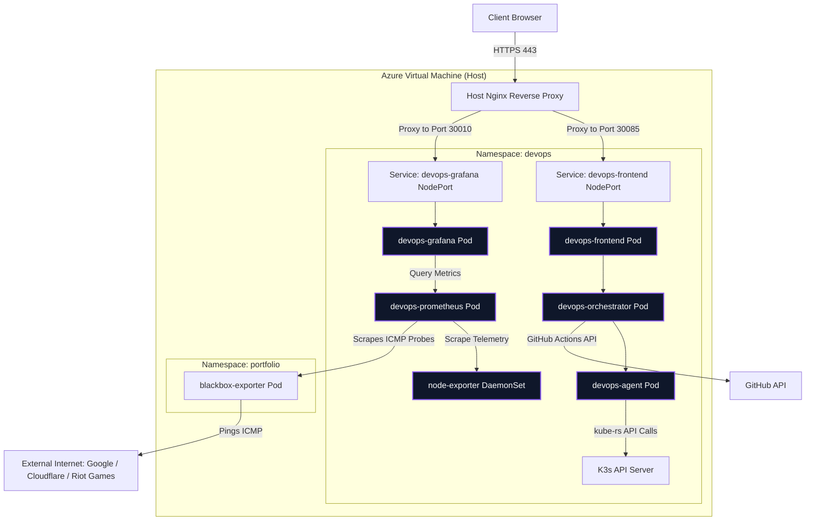
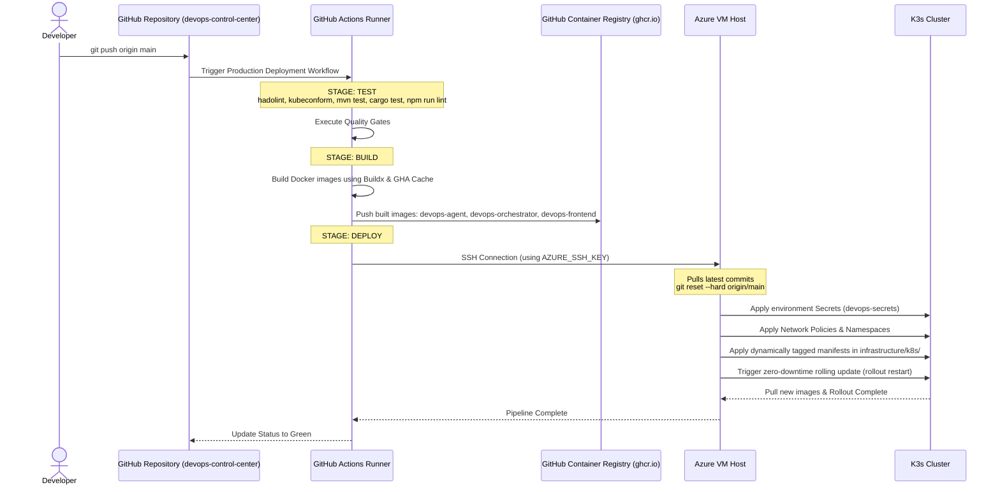

# 🚀 DevOps Control Center

A custom, end-to-end DevOps orchestration and observability platform built from scratch. This project unifies server monitoring, remote terminal execution, Kubernetes deployment management, and CI/CD pipeline tracking into a single, sleek React dashboard.

---

## 🌐 Live Preview
**Check out the live dashboard here:**  
👉 **[https://devops.mattdev0.tech](https://devops.mattdev0.tech)**

> ⚠️ **IMPORTANT WARNING FOR VISITORS** ⚠️
> 
> This is a live demonstration connected to real infrastructure. 
> **Please DO NOT stop, restart, or modify any running deployments or pods** via the dashboard unless you know what you are doing. Disrupting the deployments will bring down the services on the host server.

---

# 🏗️ Architecture

The platform is built on a modern, secure microservices architecture deployed via Kubernetes (K3s) inside the `devops` namespace, protected by strict default-deny Network Policies:



## 1. Frontend — React + Vite + Tailwind CSS + Nginx
A responsive single-page dashboard featuring:
* **Interactive PTY Terminal:** Embedded `xterm.js` terminal connected to a backend WebSocket stream with graceful unmount handling.
* **Role-Based UI Control:** Displays custom action controls based on the logged-in user's role (Admin vs. Guest).
* **Live SSE Log Viewer:** Seamlessly pulls logs via Server-Sent Events, complete with auto-scrolling and pod color headers in a premium glassmorphic modal.
* **Robust Session Management:** Enforces automatic frontend logout if the authentication token expires or gets rejected with `401`/`403`, resolving endless reconnection loops.
* **Resilience:** Integrates React Error Boundaries to prevent single-component crashes from breaking the entire dashboard.

## 2. Orchestrator — Java Spring Boot
The central gateway and security dispatcher responsible for:
* **Authentication Provider:** Issues signed JWT tokens for authenticating login requests (`/api/auth/login`) and guest access.
* **Spring Security & RBAC:** Enforces strict path authorization (e.g. restricting deployment scaling, CI/CD dispatch, and terminal execution to `ROLE_ADMIN`).
* **Protection & Hardening:** Enforces in-memory rate limiting (5 req/min) for authentication endpoints with a background eviction thread, and gracefully handles exceptions via a unified `GlobalExceptionHandler` and standard DTO mappings.
* **WebSocket Bidirectional Proxy:** Validates JWT authorization during handshakes and forwards raw terminal traffic directly to the Rust agent.
* **Async Log Proxying:** Handles long-running SSE log queries with thread-pool exhaustion safeguards (tracking client disconnects) and Spring Security async dispatches.
* **Observability:** Completely standardized on SLF4J structured logging and exposes `/actuator/health` and `/actuator/prometheus` scrape metrics.

## 3. Agent — Rust + Axum + kube-rs
A lightweight, high-performance, modular system agent running as a Kubernetes pod.
* **PTY Bridge (WebSockets):** Spawns local shells inside a pseudo-terminal (`portable-pty`) and streams stdout/stdin bidirectionally, explicitly handling zombie process termination.
* **Merged Kubernetes Logs:** Streams logs from pods in `portfolio` and `devops` namespaces concurrently using async `tokio::sync::mpsc::channel` streams.
* **Deployment Orchestrator:** Interacts directly with the local K3s API server via `kube-rs` to fetch deployment lists, scale replicas, and patch timestamps to trigger zero-downtime rolling updates.
* **Resilience & Observability:** Implements exponential backoff for K8s client initialization and emits rich, structured telemetry via the `tracing` crate.

## 4. Observability Stack — Prometheus & Grafana
* **Node Exporter:** Gathers host telemetry as a DaemonSet inside the cluster.
* **Prometheus:** Pulls metrics from the exporter, Java Spring Boot actuator endpoints, and external network pings (via Blackbox Exporter). Backed by a PersistentVolumeClaim (PVC).
* **Grafana:** Displays visual CPU and Memory dashboard panels embedded as iframes in the UI. Anonymous access is strictly limited to the `Viewer` role.

## 5. Security & Hardening
* All microservices (Agent, Orchestrator, Frontend) explicitly drop privileges to run as non-root users inside the containers.
* Kubernetes deployments strictly enforce `securityContext.runAsNonRoot: true` to prevent container runtime privilege escalation.
* **Network Policies:** The `devops` namespace is secured by a default-deny Network Policy, explicitly allowing only necessary inter-pod ingress (e.g., Orchestrator to Agent, Frontend to Orchestrator).

---

# ✨ Key Features

### 🔒 Secure JWT Authentication & RBAC
Enforces role-based permissions to protect platform modifications:
* **User Authentication:** Sign in using credentials or enter as a guest with one click.
* **Access Controls:** Read-only access for guests (monitoring only), with mutating actions (executing commands, scaling deployments, running pipelines) restricted strictly to `ROLE_ADMIN` users. Terminal stdin is explicitly disabled for guest users.
* **Rate Limiting:** Protects against brute-force login attacks using an eviction-managed token bucket filter.

### 🐚 Real-Time Interactive PTY Terminal
A fully functional remote terminal directly in your web browser.
* **Pseudo-Terminal (PTY):** Runs a live shell bridge via the Rust agent, allowing you to run interactive commands.
* **Bidirectional WebSockets:** Sends keystrokes and streams terminal outputs in real-time, proxied securely through the Spring Boot orchestrator.
* **Dynamic Grid Resizing:** Automatically synchronizes local viewport width and height to resize the remote shell's dimension.

### 🪵 Real-Time Pod Log Streaming
Stream logs dynamically from Kubernetes deployments inside the cluster.
* **Kube-rs Integration:** Directly queries pod logs from Kubernetes namespaces, merging and broadcasting system and deployment logs.
* **Resource Safe:** The Orchestrator safely terminates downstream agent connections upon client drop to prevent thread pool exhaustion.
* **Glassmorphic Viewer:** Displays log streams in a styled window, color-coding and labeling lines by pod name with auto-scrolling features.

### ☸️ Kubernetes Deployment Management
Manage Kubernetes deployments directly from the dashboard.
* **Live Status List:** Checks replication readiness, uptime, and runtime states across all namespaces via unified JSON DTOs.
* **Scaling Controls:** Spin up deployments (start) or scale them down to zero (stop).
* **Rolling Updates:** Trigger clean rolling restarts of your deployments with a single click.

### 🔄 CI/CD Pipeline Monitoring
Integrated GitHub Actions monitoring fetching real data.
* **Workflow Run Tracking:** View run logs, branches, and commit messages.
* **Manual Dispatch Triggers:** Trigger workflows manually from the dashboard.

### 📈 Deep Observability
Integrated monitoring stack powered by Prometheus and Grafana.
* **Live Resource Telemetry:** Displays CPU and Memory metrics of the Azure host.
* **Synthetic Network Monitoring:** Prometheus scrapes ICMP pings via Blackbox Exporter to track network latency and connection availability.
* **Application Metrics:** Orchestrator `/actuator/prometheus` metrics are actively scraped for advanced APM.

---

# 🛠️ Configuration & Deployment

This project uses a flexible runtime configuration strategy allowing it to run easily both locally and in production.

## Local Development
Clone the repo and run:
```bash
docker compose up --build
```
It will automatically default to `localhost` configurations, bypassing secure cookie requirements for easy development.
* Dashboard: `http://localhost:8085`

## Production Deployment & CI/CD
To deploy to a live server, create a `.env` file on the VM from the provided example:
```bash
cp .env.example .env
nano .env
```
Provide your GitHub token and public domain. The deployment steps on the VM will convert this `.env` file into a Kubernetes Secret (`devops-secrets`) automatically.



The automated GitHub Action runs across three stages (`test` → `build` → `deploy`):
1. Executes strict linting (`hadolint`, `kubeconform`) and unit test suites across Rust, Java, and React codebases.
2. Builds the Docker images on the GitHub Actions runner using Docker Buildx and GHA caching.
3. Pushes dynamically Git-SHA-tagged images to GitHub Container Registry (GHCR).
4. Connects to the Azure VM via SSH and pulls the latest code changes.
5. Injects dynamic image tags into Kubernetes manifests and applies Network Policies and secrets.
6. Restarts the pods to load the updated images with zero-downtime rolling updates.

---

# 📂 Project Structure

```text
devops-control-center/
├── apps/                       # Monorepo Applications Grouped 📂
│   ├── agent/                  # Rust Agent 🦀
│   │   ├── src/                # Modular Rust code (main, system, k8s/*, pty_handler, models)
│   │   ├── Dockerfile
│   │   └── Cargo.toml
│   ├── orchestrator/           # Spring Boot Backend ☕
│   │   ├── src/main/java/.../  # Layered architecture (controllers, services, dto, security, exceptions)
│   │   ├── Dockerfile
│   │   └── pom.xml
│   └── frontend/               # React Dashboard ⚛️
│       ├── src/                # Refactored components, services, and hooks with Error Boundaries
│       ├── Dockerfile
│       ├── nginx.conf          # Proxy configuration
│       └── vite.config.js
├── infrastructure/             # Reverse Proxy & Deployments 🌐
│   ├── nginx/                  # Nginx configuration
│   ├── k8s/                    # Kubernetes Manifests ☸️ (Deployments, Services, NetworkPolicies)
│   ├── monitoring/             # Monitoring config (Grafana dashboards, Prometheus config)
│   └── terraform/              # Terraform scripts
├── .github/workflows/          # CI/CD Pipeline (deploy.yml)
├── docker-compose.yml          # Local stack orchestration
├── .env.example                # Production environment template
└── README.md
```

---

# 🤝 Tech Stack

| Layer                | Technology / Key Libraries |
| -------------------- | -------------------------- |
| **Frontend**         | React, Vite, Tailwind CSS, `xterm.js`, `lucide-react` |
| **Backend**          | Java Spring Boot, Spring Security, JWT (io.jsonwebtoken), WebSockets, SLF4J, Actuator |
| **Agent**            | Rust, Axum, `kube-rs`, `tokio`, `portable-pty`, `tracing` |
| **Orchestration**    | Kubernetes (K3s), Docker Compose (Local Dev) |
| **Web Server / Proxy**| Nginx (with WebSocket & SSE upgrades, timeout tuning) |
| **Observability**    | Prometheus, Grafana, Node Exporter, Blackbox Exporter |

---

# 📜 License

This project is open-source and available under the MIT License.