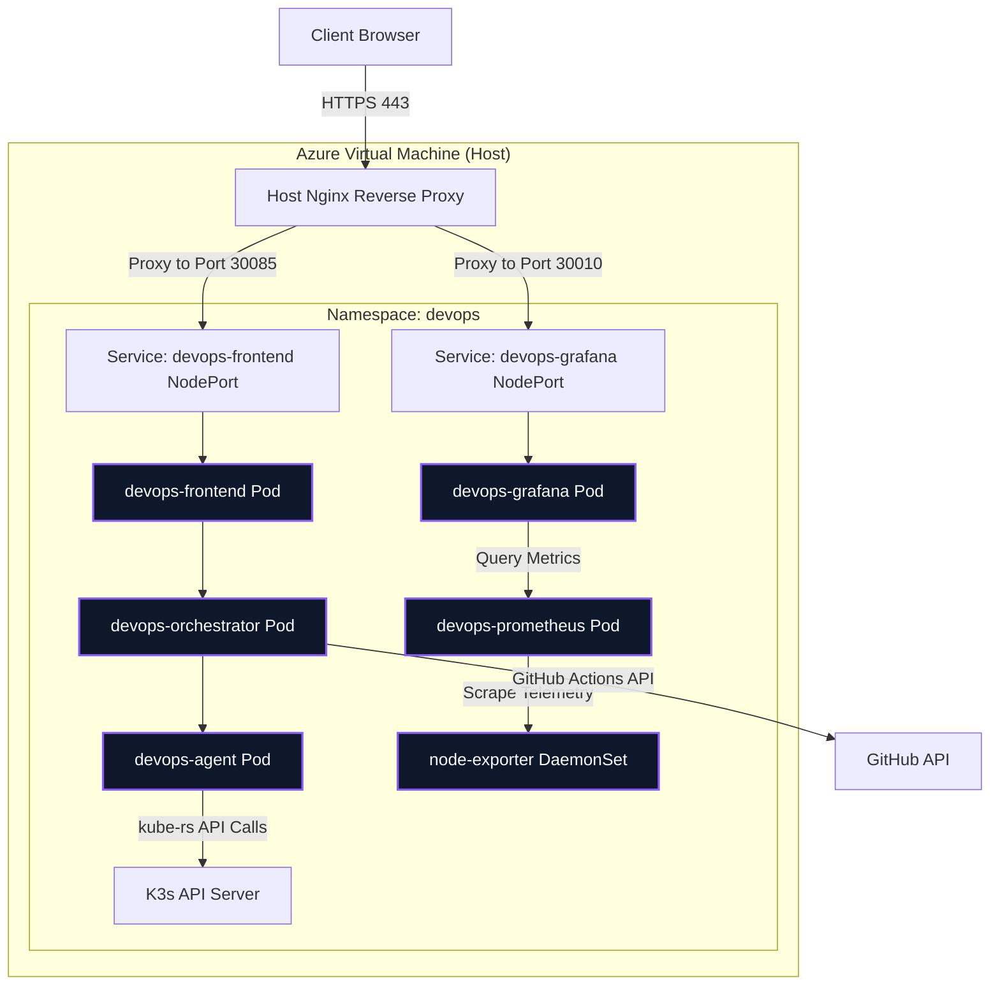
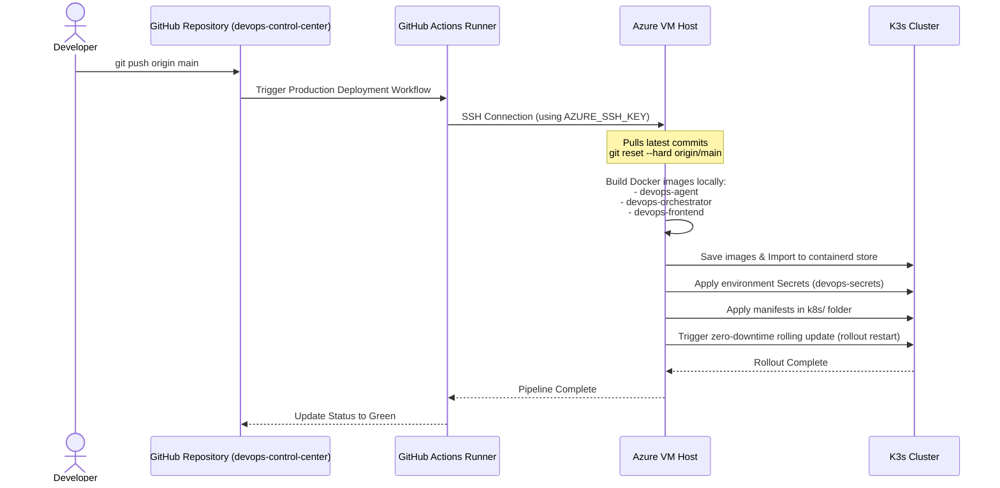

# 🚀 DevOps Control Center

A custom, end-to-end DevOps orchestration and observability platform built from scratch. This project unifies server monitoring, remote terminal execution, Docker container management, and CI/CD pipeline tracking into a single, sleek React dashboard.

---

## 🌐 Live Preview
**Check out the live dashboard here:**  
👉 **[https://mattdev0.tech/devops/](https://mattdev0.tech/devops/)**

> ⚠️ **IMPORTANT WARNING FOR VISITORS** ⚠️
> 
> This is a live demonstration connected to real infrastructure. 
> **Please DO NOT stop, restart, or modify any running Docker containers** via the dashboard unless you know what you are doing. Disrupting the containers will bring down the services on the host server.

---

# 🏗️ Architecture

The platform is built on a modern, secure microservices architecture deployed via Kubernetes (K3s) inside the `devops` namespace:



## 1. Frontend — React + Vite + Tailwind CSS + Nginx
A responsive single-page dashboard featuring:
* Embedded `xterm.js` terminals with secure input sanitization
* Live Server-Sent Events (SSE) log streaming
* Embedded Grafana metric dashboards
* Real-time infrastructure and pod visibility

## 2. Orchestrator — Java Spring Boot
The central coordination layer responsible for:
* Securely proxying commands to the Rust agent
* Integrating with the GitHub API for multi-repository CI/CD workflow fetching and dispatching
* Managing backend API communication and SSE streams

## 3. Agent — Rust + Axum + kube-rs
A lightweight, high-performance system agent running as a Kubernetes pod.
Responsibilities include:
* Executing allowlisted system commands (`ls`, `pwd`, `date`, `uptime`, etc.)
* Interacting with the Kubernetes API using `kube-rs` to manage deployments (list status, rolling restart, scale up/down)
* Streaming system logs and telemetry securely using an API key

## 4. Observability Stack — Prometheus & Grafana
* `node-exporter` gathering host metrics as a DaemonSet
* Prometheus scraping node-exporter and Spring Boot actuator metrics inside K3s
* Grafana providing visual dashboards (persistent via PVC) embedded directly into the React UI

---

# ✨ Key Features

### 🔒 Secure Remote Execution
A fully interactive terminal directly in the browser.
* Allowlisted command execution.
* Input sanitization to prevent control-character injection.
* Live command output streaming.

### 🐳 Docker Management
Manage Docker containers directly from the dashboard.
* View running/stopped containers.
* Start, stop, and restart containers remotely.

### 🔄 CI/CD Pipeline Monitoring
Integrated GitHub Actions monitoring fetching real data.
* Workflow status tracking.
* Commit and branch visibility.
* Manual deployment triggers (dispatch).

### 📈 Deep Observability
Integrated monitoring stack powered by Prometheus and Grafana.
* Real-time host CPU and Memory monitoring.
* Secure iframe embedding configured for cross-domain access.

---

# 🛠️ Configuration & Deployment

This project uses a flexible runtime configuration strategy allowing it to run easily both locally and in production.

## Local Development
Clone the repo and run:
```bash
docker compose up --build
```
It will automatically default to `localhost` configurations, bypassing secure cookie requirements for easy development.
* Dashboard: `http://localhost:8085`

## Production Deployment
To deploy to a live server, create a `.env` file from the provided example:
```bash
cp .env.example .env
nano .env
```
Provide your GitHub token and public domain. The GitHub Action will convert this `.env` file into a Kubernetes Secret (`devops-secrets`) automatically during deploy.



The automated GitHub Action runs:
1. Connects to the Azure VM via SSH
2. Pulls the latest code changes
3. Builds the Docker images locally:
   - `devops-agent`
   - `devops-orchestrator`
   - `devops-frontend`
4. Imports them into K3s containerd cache
5. Generates/applies the Kubernetes Secret
6. Applies K8s manifests in the `k8s/` folder
7. Restarts the pods to apply updates

---

# 📂 Project Structure

```text
devops-control-center/
├── agent/                      # Rust Agent 🦀
│   ├── src/main.rs
│   ├── Dockerfile
│   └── Cargo.toml
├── orchestrator/               # Spring Boot Backend ☕
│   ├── src/main/java/.../
│   ├── Dockerfile
│   └── pom.xml
├── frontend/                   # React Dashboard ⚛️
│   ├── src/App.jsx
│   ├── Dockerfile
│   ├── nginx.conf              # Subpath proxy configuration
│   └── vite.config.js
├── k8s/                        # Kubernetes Manifests ☸️
│   ├── namespace.yaml
│   ├── agent.yaml
│   ├── orchestrator.yaml
│   ├── frontend.yaml
│   ├── prometheus.yaml
│   ├── grafana.yaml
│   └── node-exporter.yaml
├── grafana/                    # Local Provisioning & Dashboards 📊
├── docker-compose.yml          # Local stack orchestration
├── .env.example                # Production environment template
└── prometheus.yml
```

---

# 🤝 Tech Stack

| Layer                | Technology                |
| -------------------- | ------------------------- |
| Frontend             | React, Vite, Tailwind CSS |
| Backend              | Java Spring Boot          |
| Agent                | Rust, Axum, Bollard       |
| Container Management | Docker, Docker Compose    |
| Web Server / Proxy   | Nginx                     |
| Monitoring           | Prometheus, Grafana       |

---

# 📜 License

This project is open-source and available under the MIT License.