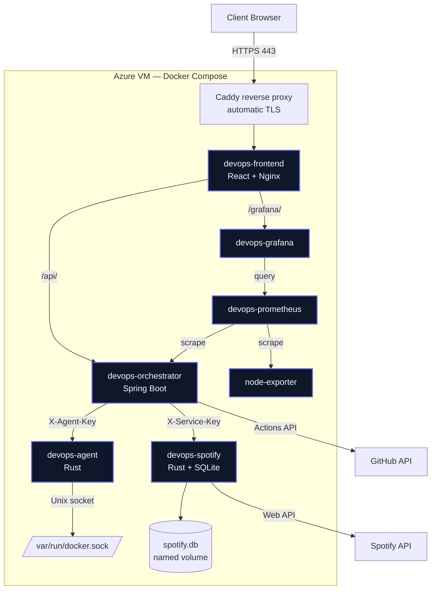
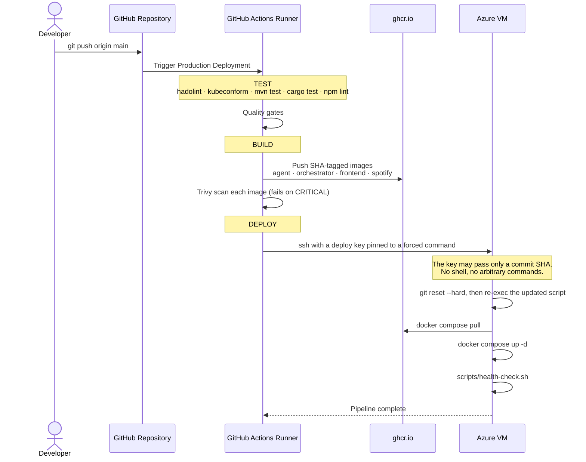

# 🚀 DevOps Control Center

A custom, end-to-end DevOps orchestration and observability platform built from scratch. This project unifies server monitoring, Kubernetes deployment management, and CI/CD pipeline tracking into a single, sleek React dashboard.

---

## 🌐 Live Preview
**Check out the live dashboard here:**  
👉 **[https://devops.mattdev0.tech](https://devops.mattdev0.tech)**

> ⚠️ **IMPORTANT WARNING FOR VISITORS** ⚠️
> 
> This is a live demonstration connected to real infrastructure. 
> **Please DO NOT stop, restart, or modify any running deployments or pods** via the dashboard unless you know what you are doing. Disrupting the deployments will bring down the services on the host server.

---

# 🏗️ Architecture

The platform runs on a lightweight, secure microservices architecture orchestrated via **Docker Compose with Caddy reverse proxy** on an Azure Linux VM. Kubernetes manifests under `infrastructure/k8s/` are maintained as a supported alternative target for multi-node deployments.

> **Kubernetes features in the current deployment**
> Production runs on Docker Compose, so there is no cluster attached. The agent
> verifies connectivity to an API server before reporting Kubernetes as
> available; when there is none it reports `k8s: false`, cluster-backed routes
> return `503`, and the dashboard replaces the deployment and pod-health panels
> with an explicit "no cluster connected" state rather than showing empty tables
> or a 100% availability figure for a cluster that is not there. Docker,
> monitoring, CI/CD and system features are unaffected. Deploying the manifests
> under `infrastructure/k8s/` restores the cluster features automatically, with
> credentials supplied by the agent's service account.


```mermaid
graph TD
    Client[Client Browser] -->|HTTPS 443| Caddy[Caddy reverse proxy<br/>automatic TLS]

    subgraph VM["Azure VM &mdash; Docker Compose"]
        Caddy --> FE[devops-frontend<br/>React + Nginx]
        FE -->|/api/| Orch[devops-orchestrator<br/>Spring Boot]
        FE -->|/grafana/| Graf[devops-grafana]

        Orch -->|X-Agent-Key| Agent[devops-agent<br/>Rust]
        Orch -->|X-Service-Key| Spot[devops-spotify<br/>Rust + SQLite]

        Agent -->|Unix socket| Sock[/var/run/docker.sock/]
        Spot --> DB[(spotify.db<br/>named volume)]

        Graf -->|query| Prom[devops-prometheus]
        Prom -->|scrape| NodeExp[node-exporter]
        Prom -->|scrape| Orch
    end

    Orch -->|Actions API| GitHub[GitHub API]
    Spot -->|Web API| Spotify[Spotify API]

    classDef svc fill:#0f172a,stroke:#6366f1,stroke-width:2px,color:#f8fafc;
    class FE,Orch,Agent,Spot,Graf,Prom,NodeExp svc;
```

> The agent also speaks to a Kubernetes API when one is present. This deployment
> has no cluster, so those features report themselves unavailable rather than
> failing; see the note above.

## 1. Frontend — React + Vite + Tailwind CSS + Nginx
A responsive single-page dashboard featuring:
* **K8s Health & SLO Dashboard:** Dynamic panel showing pod status cards, Availability SLI circular gauge, and Error Budget tracking bar.
* **Role-Based UI Control:** Displays custom action controls based on the logged-in user's role (Admin vs. Guest).
* **Live SSE Log Viewer:** Seamlessly pulls logs via Server-Sent Events, complete with auto-scrolling and pod color headers in a premium glassmorphic modal.
* **Robust Session Management:** Enforces automatic frontend logout if the authentication token expires or gets rejected with `401`/`403`.
* **Resilience:** Integrates React Error Boundaries to prevent single-component crashes from breaking the entire dashboard.

## 2. Orchestrator — Java Spring Boot
The central gateway and security dispatcher responsible for:
* **Authentication Provider:** Issues signed JWT tokens for authenticating login requests (`/api/auth/login`) and guest access.
* **Spring Security & RBAC:** Enforces strict path authorization (e.g. restricting deployment scaling and CI/CD dispatch to `ROLE_ADMIN`).
* **Protection & Hardening:** Enforces in-memory rate limiting (5 req/min) for authentication endpoints with a background eviction thread, and gracefully handles exceptions via a unified `GlobalExceptionHandler` and standard DTO mappings.
* **API Proxy Layer:** Securely forwards authenticated cluster health queries (e.g., `/api/servers/pods/health`) directly to the Rust system agent.
* **Async Log Proxying:** Handles long-running SSE log queries with thread-pool exhaustion safeguards (tracking client disconnects) and Spring Security async dispatches.
* **Observability:** Completely standardized on SLF4J structured logging and exposes `/actuator/health` and `/actuator/prometheus` scrape metrics.

## 3. Agent — Rust + Axum + kube-rs
A lightweight, high-performance, modular system agent. It runs as a container under Docker Compose in the current deployment, or as a pod when the Kubernetes manifests are used.
* **Pod Health Reporter:** *(requires a cluster)* Queries the Kubernetes API server for pod states across target namespaces, aggregating them into Running/Pending/Failed/CrashLoop counts.
* **Merged Kubernetes Logs:** *(requires a cluster)* Streams logs from pods in `portfolio` and `devops` namespaces concurrently using async `tokio::sync::mpsc::channel` streams.
* **Deployment Orchestrator:** *(requires a cluster)* Interacts with the Kubernetes API server via `kube-rs` to fetch deployment lists, scale replicas, and patch timestamps to trigger zero-downtime rolling updates.
* **State Transition Webhooks:** Actively monitors deployment state changes and broadcasts real-time alerts to Discord webhooks upon state transitions (e.g., Running, Failed).
* **Resilience & Observability:** Verifies the Kubernetes API actually answers before advertising cluster support, degrades to Docker-only operation when no cluster is present, and emits rich, structured telemetry via the `tracing` crate.

## 4. Spotify Service — Rust + Axum + SQLite
A small analytics service for listening history.

Spotify's Web API cannot answer most of what a listening dashboard wants: it exposes top artists and tracks over three fixed windows and the **last 50 plays**, and nothing else historical. `audio-features` and `recommendations` return 403 and 404 for newer apps.
* **Builds its own history:** polls recently-played every 20 minutes and stores plays in SQLite keyed on `(track_id, played_at)`, which is what the overlapping response windows dedupe against. History lives on a named volume and survives redeploys.
* **Genre aggregation:** genres come from the artists endpoint, cached since they are effectively static, then weighted by play count.
* **Local-time bucketing:** Spotify timestamps are UTC; `SPOTIFY_UTC_OFFSET_HOURS` shifts the hour and weekday buckets so "when do I listen" means something.

## 5. Observability Stack — Prometheus & Grafana
* **Node Exporter:** Gathers host telemetry as a DaemonSet inside the cluster.
* **Prometheus:** Pulls metrics from the exporter, Java Spring Boot actuator endpoints, and external network pings (via Blackbox Exporter). Backed by a PersistentVolumeClaim (PVC).
* **Grafana:** Displays visual CPU and Memory dashboard panels embedded as iframes in the UI. Anonymous access is strictly limited to the `Viewer` role.

## 6. Security & Hardening
* All microservices (Agent, Orchestrator, Frontend) explicitly drop privileges to run as non-root users inside the containers.
* Kubernetes deployments strictly enforce `securityContext.runAsNonRoot: true` to prevent container runtime privilege escalation, and utilize `readOnlyRootFilesystem: true` to guarantee immutable container states (with `emptyDir` mounts for `/tmp` where necessary).
* **Network Policies:** The `devops` namespace is secured by a default-deny Network Policy, explicitly allowing only necessary inter-pod ingress (e.g., Orchestrator to Agent, Frontend to Orchestrator).
* **Agent Security:** The rust agent enforces strict startup failures if the `AGENT_SECRET_KEY` is missing, preventing accidental bypasses.
* **Least-privilege service identities:** the orchestrator reaches the agent and the Spotify service through separate shared secrets, both compared in constant time; the browser never talks to either directly. Docker container actions require `ROLE_ADMIN`, and the agent refuses actions targeting the platform's own containers.

---

# ✨ Key Features

### 🔒 Secure JWT Authentication & RBAC
Enforces role-based permissions to protect platform modifications:
* **Guest by default:** visitors enter read-only guest mode automatically; administrators sign in through a modal when they need to act.
* **Access Controls:** Read-only access for guests (monitoring only), with mutating actions (scaling deployments, running pipelines) restricted strictly to `ROLE_ADMIN` users.
* **Rate Limiting:** Protects against brute-force login attacks using an eviction-managed token bucket filter.

### 📊 Kubernetes Health & SLO Dashboard *(requires a cluster)*
Visualize real-time cluster workloads and Service Level Objectives (SLOs):
* **Monitored Namespaces Overview:** View pod status summaries (Running, Pending, Failed, CrashLoop) for target namespaces (`devops` and `portfolio`).
* **Availability SLI:** Track real-time pod availability percentages mapped via a dynamic progress ring.
* **Error Budget remaining:** Visual progress bar showing consumed vs. remaining error budget based on a targeted 99.9% availability objective.

### 🪵 Real-Time Pod Log Streaming *(requires a cluster)*
Stream logs dynamically from Kubernetes deployments inside the cluster.
* **Kube-rs Integration:** Directly queries pod logs from Kubernetes namespaces, merging and broadcasting system and deployment logs.
* **Resource Safe:** The Orchestrator safely terminates downstream agent connections upon client drop to prevent thread pool exhaustion.
* **Glassmorphic Viewer:** Displays log streams in a styled window, color-coding and labeling lines by pod name with auto-scrolling features.

### ☸️ Kubernetes Deployment Management *(requires a cluster)*
Manage Kubernetes deployments directly from the dashboard.
* **Live Status List:** Checks replication readiness, uptime, and runtime states across all namespaces via unified JSON DTOs.
* **Scaling Controls:** Spin up deployments (start) or scale them down to zero (stop).
* **Rolling Updates:** Trigger clean rolling restarts of your deployments with a single click.

### 🐳 Docker Container Management
Manage the containers on the host directly from the dashboard.
* **Live inventory:** state, image, ports and uptime for every container, with per-container CPU and memory.
* **Lifecycle actions:** start, stop and restart, restricted to `ROLE_ADMIN`. The agent refuses actions targeting the platform's own containers, so the dashboard cannot stop the proxy out from under itself.
* **Log streaming:** follow container stdout/stderr over SSE.

### 🎧 Spotify Listening Analytics
A listening dashboard built on data the Spotify API does not itself provide.
* **Top artists, tracks and genres** over Spotify's four-week window.
* **Listening patterns** by hour and weekday, computed from play history this platform records itself, in local time.
* **Discovery ratio** separating first plays from repeats.
* **Honest about its limits:** Spotify exposes only the last 50 plays, so history accumulates from first deploy and the UI says so rather than showing an empty chart.

### 🔄 CI/CD Pipeline Monitoring
Integrated GitHub Actions monitoring fetching real data.
* **Workflow Run Tracking:** View run logs, branches, and commit messages.
* **Manual Dispatch Triggers:** Trigger workflows manually from the dashboard.

### 📈 Deep Observability
Integrated monitoring stack powered by Prometheus and Grafana.
* **Live Resource Telemetry:** Displays CPU and Memory metrics of the Azure host.
* **Synthetic Network Monitoring:** Prometheus scrapes ICMP pings via Blackbox Exporter to track network latency and connection availability.
* **Application Metrics:** Orchestrator `/actuator/prometheus` metrics are actively scraped for advanced APM.

---

# 🛠️ Configuration & Deployment

This project uses a flexible runtime configuration strategy allowing it to run easily both locally and in production.

## Local Development
Clone the repo and run:
```bash
cp .env.example .env   # fill in the required secrets first
docker compose up --build
```

`JWT_SECRET`, `ADMIN_PASSWORD` and `AGENT_SECRET_KEY` are mandatory; the stack fails closed without them rather than starting with defaults. The Spotify service additionally needs `SPOTIFY_CLIENT_ID`, `SPOTIFY_CLIENT_SECRET`, `SPOTIFY_REFRESH_TOKEN` and `SPOTIFY_SERVICE_KEY` - `apps/spotify-service/scripts/authorize.py` obtains a refresh token with the required scopes.

`DOCKER_GID` must match the host's `docker` group so the agent can read the socket; find it with `getent group docker | cut -d: -f3`.

Local runs default to `localhost` configuration, relaxing the secure-cookie requirement.
* Dashboard: `http://localhost:8085`

## Production Deployment & CI/CD
To deploy to a live server, create a `.env` file on the VM from the provided example:
```bash
cp .env.example .env
nano .env
```
Provide your GitHub token and public domain. `JWT_SECRET`, `ADMIN_PASSWORD` and `AGENT_SECRET_KEY` are mandatory - `scripts/deploy.sh` refuses to deploy without them rather than falling back to defaults. `SPOTIFY_SERVICE_KEY` is shared between the orchestrator and the Spotify service, and `DOCKER_GID` must match the host's `docker` group. When deploying the Kubernetes manifests instead, the same values are supplied as the `devops-secrets` Secret.


```mermaid
sequenceDiagram
    actor Developer
    participant GitHub as GitHub Repository
    participant Runner as GitHub Actions Runner
    participant GHCR as ghcr.io
    participant VM as Azure VM

    Developer->>GitHub: git push origin main
    GitHub->>Runner: Trigger Production Deployment

    Note over Runner: TEST<br/>hadolint · kubeconform · mvn test · cargo test · npm lint
    Runner->>Runner: Quality gates

    Note over Runner: BUILD
    Runner->>GHCR: Push SHA-tagged images<br/>agent · orchestrator · frontend · spotify
    Runner->>Runner: Trivy scan each image (fails on CRITICAL)

    Note over Runner: DEPLOY
    Runner->>VM: ssh with a deploy key pinned to a forced command
    Note over VM: The key may pass only a commit SHA.<br/>No shell, no arbitrary commands.
    VM->>VM: git reset --hard, then re-exec the updated script
    VM->>GHCR: docker compose pull
    VM->>VM: docker compose up -d
    VM->>VM: scripts/health-check.sh
    VM-->>Runner: Pipeline complete
```

The pipeline runs `test` → `build` → `deploy`:

1. **PR validation** — `test.yml` gates pull requests with `hadolint`, `kubeconform`, and the Java, Rust and frontend test suites.
2. **Build** — images built with Buildx and GHA caching, tagged with the commit SHA, then scanned with Trivy. A CRITICAL finding fails the build.
3. **Deploy** — SSH to the VM using a **dedicated deploy key restricted to a forced command**. The key can trigger a deploy of a given commit and nothing else: no shell, no arbitrary commands, no port forwarding. The host key is pinned rather than trusted on first use.
4. **On the host** — `deploy.sh` syncs the checkout, re-execs itself so the rest of the run uses the updated script, pulls the SHA-tagged images, recreates changed containers, and runs the health check.

> **Why not OIDC?** The previous pipeline used GitHub OIDC workload identity with
> `az vm run-command`, which stored no long-lived credentials. The current Azure
> tenant blocks Entra app registration, so no service principal can be created and
> that route is unavailable. The mitigations are the forced command on the host,
> which accepts only a validated commit SHA, and a key that grants no shell.

---

# 📂 Project Structure

```text
devops-control-center/
├── apps/                       # Monorepo Applications Grouped 📂
│   ├── agent/                  # Rust Agent 🦀
│   │   ├── src/                # Modular Rust code (main, system, k8s/*, models)
│   │   ├── Dockerfile
│   │   └── Cargo.toml
│   ├── orchestrator/           # Spring Boot Backend ☕
│   │   ├── src/main/java/.../  # Layered architecture (controllers, services, dto, security, exceptions)
│   │   ├── Dockerfile
│   │   └── pom.xml
│   ├── spotify-service/        # Spotify listening analytics 🎧
│   │   ├── src/                # axum handlers, SQLite storage, Spotify client
│   │   ├── scripts/            # authorize.py - one-off OAuth for the refresh token
│   │   └── Dockerfile
│   └── frontend/               # React Dashboard ⚛️
│       ├── src/                # Refactored components, services, and hooks with Error Boundaries
│       ├── Dockerfile
│       ├── nginx.conf          # Proxy configuration
│       └── vite.config.js
├── infrastructure/             # Reverse Proxy & Deployments 🌐
│   ├── nginx/                  # Nginx configuration
│   ├── k8s/                    # Kubernetes manifests ☸️ - a supported alternative target, not what production runs
│   ├── monitoring/             # Monitoring config (Grafana dashboards, Prometheus config)
│   └── terraform/              # Terraform example placeholder scripts
├── .github/workflows/          # CI/CD (deploy-compose.yml, test.yml)
├── docker-compose.yml          # Stack definition (also the production base)
├── docker-compose.prod.yml     # Production overrides: images, memory limits
├── .env.example                # Production environment template
└── README.md
```

---

# 🤝 Tech Stack

| Layer                | Technology / Key Libraries |
| -------------------- | -------------------------- |
| **Frontend**         | React, Vite, Tailwind CSS, `lucide-react` |
| **Backend**          | Java Spring Boot, Spring Security, JWT (io.jsonwebtoken), SLF4J, Actuator |
| **Agent**            | Rust, Axum, `kube-rs`, `bollard` (Docker), `tokio`, `tracing` |
| **Spotify Service**  | Rust, Axum, `rusqlite` (bundled SQLite), `reqwest` |
| **Orchestration**    | Docker Compose (Primary Runtime), Kubernetes Manifests (Multi-node Target) |
| **Web Server / Proxy**| Caddy (TLS termination & Host Reverse Proxy) + Nginx (Frontend Container) |
| **Observability**    | Prometheus (with alerting rules), Grafana, Node Exporter, Blackbox Exporter |
| **CI/CD**            | GitHub Actions, Buildx + GHA cache, Trivy, hadolint, SSH deploy behind a forced command |

---

# 📜 License

This project is open-source and available under the MIT License.